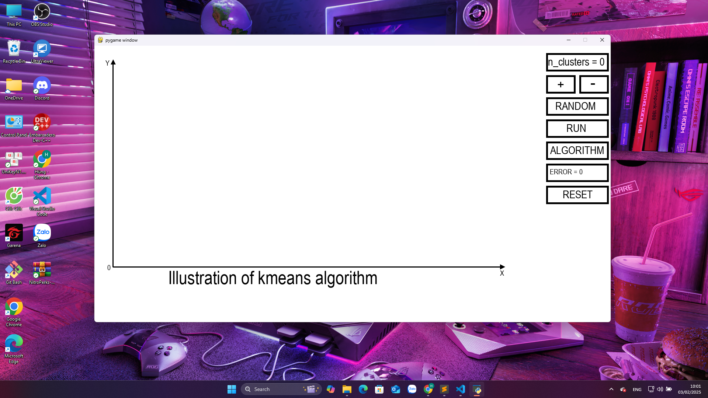

### Cách tổ chức dự án:
```bash
├── image/          # ảnh demo 
├── img/            # ảnh cho đầu vào của thuật toán KMeans
├── list_img/       # folder cho ảnh đầu ra sau mỗi lần chạy thuật toán KMeans
├── algorithm.py   # file code chứa các thuật toán đã tự code lại bằng tay
├── Img_KMeans.py  # file để hiển thị GUI lên màn hình show lên kết quả sau khi thực hiện thuật toán KMeans.
├── KMeans.py      # file để hiển thị chương trình minh họa thuật toán KMeans
├── README.md      # file ghi chú cho project
└── requirements.txt # Các thư viện phụ thuộc
```
### Cách chạy dự án mở terminal hoặc cmd trên laptop và copy dòng lệnh dưới đây để cài các thư viện cần thiết: 
```bash
pip install -r requirements
```

### Sau đó chạy file KMeans.py thì sẽ chạy được chương trình minh họa thuật toán kmeans và cách tiến hành thuật toán hình ảnh sau khi chạy: 

[Video demo](https://youtu.be/TWBFik1oE0U)
### Ta áp dụng thuật toán KMeans vào xử lý ảnh. Chạy file Img_KMeans.py hình ảnh sau khi chạy: 

[Video demo](https://youtu.be/9KUuzOT_w2g) 

