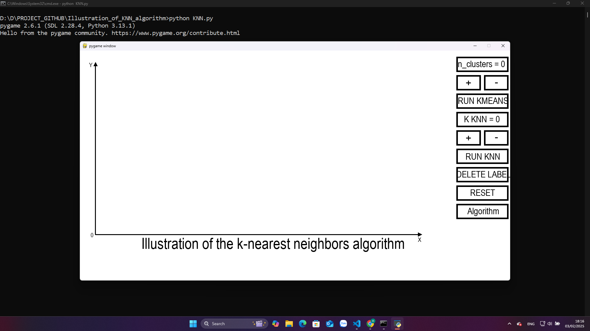

### Giới thiệu về dự án:
Dự án cá nhân của mình là mình sử dụng các kiến thức về lập trình và cấu trúc dữ liệu và giải thuật kèm theo các kiến thức về toán học để triển khai minh họa lại quá trình thuật toán KNN hoạt động ra sao mà không sử dụng đến thư viện chỉ dùng lập trình để minh họa lên cách thuật toán hoạt động.
### Cách tổ chức dự án:
```bash
├── image          # ảnh demo 
├── KNN.py          # file code minh họa thuật toán KNN 
├── algorithm.py # file code chứa các thuật toán sử dụng đã code lại bằng tay
└── requirements.txt # Các thư viện phụ thuộc
```
### Cách chạy dự án mở terminal hoặc cmd trên laptop và copy dòng lệnh dưới đây để cài các thư viện cần thiết: 
```bash
pip install -r requirements
```

### Sau đó chạy file KNN.py thì sẽ chạy được chương trình minh họa thuật toán KNN và cách tiến hành thuật toán hình ảnh sau khi chạy: 

[Video demo](https://youtu.be/2Ug3PSD5Zzw)
